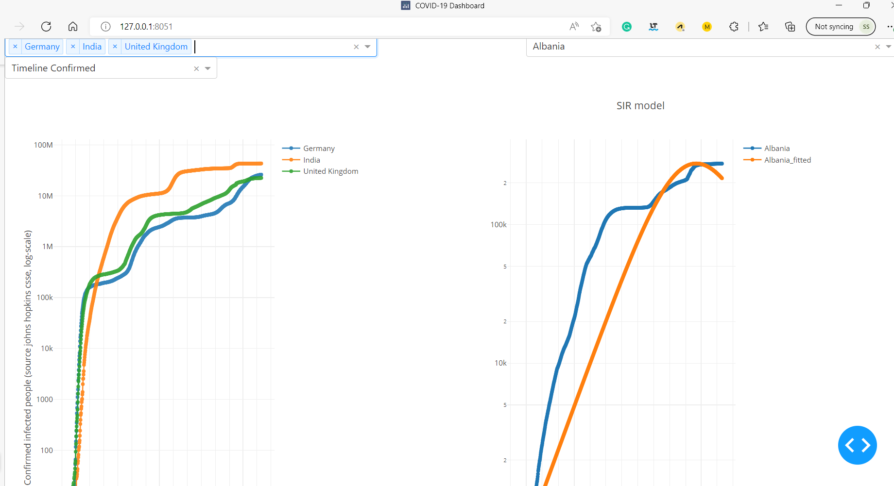

ADS_COVID-19
==============================
Applied data science on COVIID 19 data (Enterprise Data Science 2022) as a part of lecture in TU Kaiserslautern. 

Goals
----
1.  Transport best practices from industry to develope a COVID-19 analysis prototype. 

    Utilisation of CRISP-DM process for bussiness model. 

    

    The CRISP-DM process model involves the following steps: 

    • Business understanding
    • Data Understanding
    • Data Preparation
    • Modeling (statistical and machine learning)
    • Deployment

2.  Analyse the confirmed cases for all the countries
3.  Calculation the doubling rate, filtered.
4.  Simulate the spread of COVID-19using SIR modelfor any country.
5.  Create a user friendly dashboard, which shows the current count of confirmed cases, doubling rate and SIR model.
6. Create a world map for covid infected data as an animation.

Dataset sources 
----------------
1. RKI, webscrape (webscraping) https://www.rki.de/DE/Content/InfAZ/N/Neuartiges_Coronavirus/Fallzahlen.html
2. John Hopkins (GITHUB) https://github.com/CSSEGISandData/COVID-19.git
3. Our world in data (https://covid.ourworldindata.org/data/owid-covid-data.csv)

Static Visualisations : Delivery 1
----------------------------------

1. The relative cases overtime of Covid infectors (absolut Covid cases/population size) as static visualization fro 3 countries. 

 
2. The vaccination rate (percentage of the population) over time for 3 countries. 

Dynamic Dashboard : Delivery 3 and delivery 4
---------------------------------------------
1. Covid-19 dashboard prototype developed following the video lecture from Prof. Dr. Kienle. 

Static look of the Covid-19 dashboard prototype. 

2. SIR virus spread model has to be implemented in the dynamic dashboard (DASH implementation).

Static look of SIR virus spread dashboard prototype. 

3. Both delivery 3 and delivery 4 combined as a single dashboard. 

Static look of combined dashboard prototype. 

Project Organization
------------
    ├── LICENSE
    ├── Makefile           <- Makefile with commands like `make data` or `make train`
    ├── README.md          <- The top-level README for developers using this project.
    ├── data
    │   ├── external       <- Data from third party sources.
    │   ├── interim        <- Intermediate data that has been transformed.
    │   ├── processed      <- The final, canonical data sets for modeling.
    │   └── raw            <- The original, immutable data dump.
    │
    ├── docs               <- A default Sphinx project; see sphinx-doc.org for details
    │
    ├── projectdelivery_sourcecode_notebooks  <- Notebooks for delivery 1,2 and 3 with the source code.
    ├── plots              <- static visualisation for deliveries
    ├── models             <- Trained and serialized models, model predictions, or model summaries (e.g. SIR model fit)
    │
    ├── notebooks          <- Jupyter notebooks taking assistance from lecture
    │                         the creator's initials, and a short `-` delimited description, e.g.
    │                         `1.0-jqp-initial-data-exploration`.
    │
    ├── references         <- Data dictionaries, manuals, and all other explanatory materials.
    │
    ├── reports            <- Generated analysis as HTML, PDF, LaTeX, etc.
    │   └── figures        <- Generated graphics and figures to be used in reporting
    │
    ├── requirements.txt   <- The requirements file for reproducing the analysis environment, e.g.
    │                         generated with `pip freeze > requirements.txt`
    │
    ├── setup.py           <- makes project pip installable (pip install -e .) so src can be imported
    ├── src                <- Source code for use in this project.
    │   ├── __init__.py    <- Makes src a Python module
    │   │
    │   ├── data           <- Scripts to download or generate data
    │   │   └── make_dataset.py
    │   │
    │   ├── features       <- Scripts to turn raw data into features for modeling
    │   │   └── build_features.py
    │   │
    │   ├── models         <- Scripts to train models and then use trained models to make
    │   │   │                 predictions
    │   │   ├── predict_model.py
    │   │   └── train_model.py
    │   │
    │   └── visualization  <- Scripts to create exploratory and results oriented visualizations
    │       └── visualize.py
    │
    └── tox.ini            <- tox file with settings for running tox; see tox.readthedocs.io

